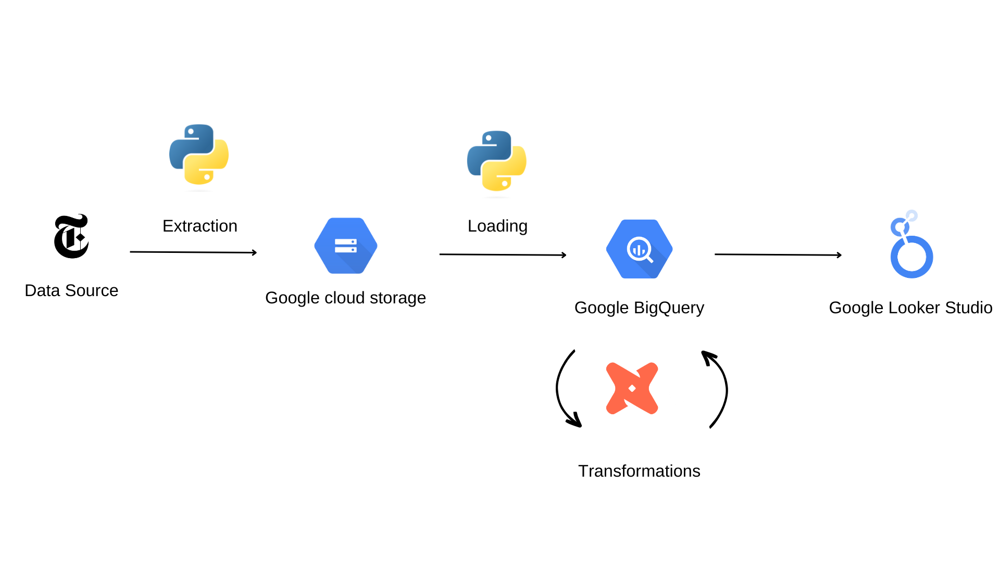

<a name="readme-top"></a>

<!-- PROJECT LOGO -->
<br />
<div align="center">
  <a href="https://github.com/tandreadi/nyt_articles">
    
  </a>

<h3 align="center">New York Times' articles metadata analysis </h3>

  <p align="center">
    End-to-End Data Engineering project that uses the Times Newswire API
    <br />
    <a href="https://github.com/tandreadi/nyt_articles/loader">View Extraction and Loading</a>
    ·
    <a href="https://github.com/tandreadi/nyt_articles/dbt">View Transformations</a>
    ·
    <a href="https://lookerstudio.google.com/reporting/7c0e83ec-0f80-4b6f-9e53-0eeaa4eb920e">View Dashboard</a>
  </p>
</div>


<!-- ABOUT THE PROJECT -->
## About The Project

The purpose of this project is to make an end to end data pipeline which extracts the New York Times' article metadata from the [Times Newswire API](https://developer.nytimes.com/docs/timeswire-product/1/overview) and load this data in Google Cloud storage and Big Query, transform and model the data using dbt and build a Looker dashboard to vizualize:

* How many articles are published every day?
* What kind of articles are published?
* Which are the characteristics of each material type?
* Which are the top 5 referred articles?
* What kind of articles do the top 10 authors write?

### Data Pipeline Architecture

<div align="center">
  <a href="https://github.com/tandreadi/nyt_articles">
    
  </a>
</div>

### Technology Stack

* [Google Cloud Storage](https://cloud.google.com/storage) - Data Lake
* [Python](https://www.python.org/) - Extraction and Loading
* [Google BigQuery](https://cloud.google.com/bigquery) - Data Warehouse
* [dbt](https://www.getdbt.com/) - Transformations
* [Google Looker studio](https://lookerstudio.google.com/) - Visualizations


### Project Set up

1. Sign up and get a free API Key at [The New York Times Developer Network](https://developer.nytimes.com/docs/timeswire-product/1/overview)
2. Clone the repo
   ```sh
   git clone https://github.com/tandreadi/nyt_articles.git
   ```
3. Install the necessary python libraries into a virtual environment
   ```sh
   pip install -r requirements.txt
   ```
   Set the environmental variable **API_KEY** with your API key
   ```sh
   conda env config vars set API_KEY= 'your API key'
   ```   
4. Setup a Google Cloud Platform project and download the JSON credentials
5. Extract and load the data
  * Change directory to **loader**
  * Deploy the **cloud function**
   ```sh
   gcloud functions deploy load_articles --runtime=python38 --trigger-topic=LOAD_ARTICLES
   ```
  * Create a **pubsub trigger event** to extract and load the data
   ```sh
   gcloud pubsub topics publish LOAD_ARTICLES --message "test"
   ```   
6. Model the data and perform the transformations
  * Change directory to **dbt**
  * Build the dbt project
   ```sh
   dbt build
   ```
7. Connect BigQuery with Looker studio and design the dashboard


<!-- ACKNOWLEDGMENTS -->
## Acknowledgments

* [dbt Best Practices](https://docs.getdbt.com/guides/best-practices)
* [Cloud Storage documentation](https://cloud.google.com/storage/docs)

<p align="right">(<a href="#readme-top">back to top</a>)</p>